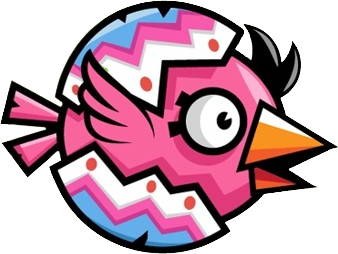
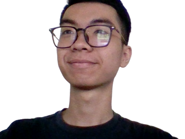
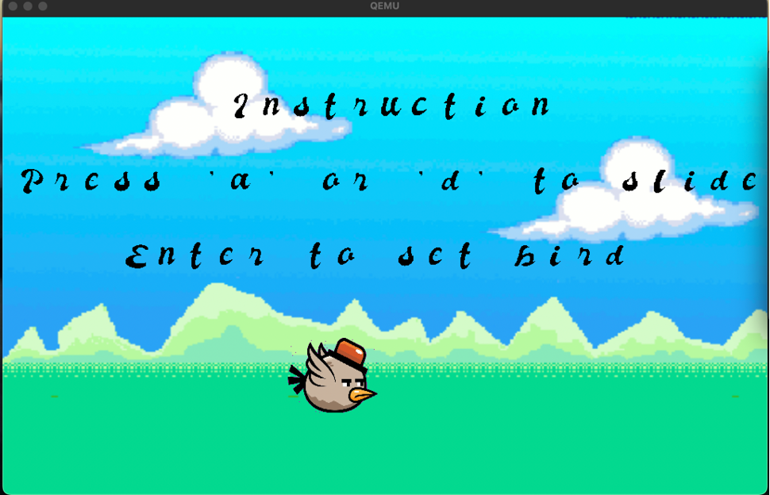

# Bird Bay Lag Game Project

> Dive into the thrill of a bird's journey!

**Group Odyssey** 🚀 - Group 13 OS - Game Adventure  

_Code Quest: **EEET2490_G13_GroupProject**_

# 🚀 Table of Adventures 🚀

- 🌍 [**Welcome to Bird Bay Lag Game Project**](#bird-bay-lag-game-project)
- 📖 [**Navigating the Adventure**](#table-of-content)
- 💡 [**Diving In: Introduction**](#introduction)
  - 🌟 [**Highlights & Features**](#features-at-a-glance)
- 🛠 [**Crafted Tools**](#built-with)
- 🎮 [**The Game's Lore 🐦**](#game-content)
  - ⚔ [**Gameplay Mechanics**](#game-mechanics)
    - 🚧 [**Challenges & Obstacles**](#obstacles)
    - ⚙️ [**Tailoring Your Experience**](#customizations)
    - 🌄 [**Backdrop of Adventure**](#background)
    - 🐤 [**Choosing Your Hero**](#bird)
    - 🔥 [**Modulating Challenge**](#difficulty)
    - 🎞 [**The Visual Epic**](#final-product)
    - 🕹 [**Mastering Controls**](#controls)
    - 🏆 [**Scoring & Achievements**](#scoring)
    - 📊 [**After the Game**](#post-game)
    - 📖 [**Instructions & Guide**](#instructions)
- 🌌 [**Beyond the Game**](#other-content)
  - 🎨 [**Visual Arts: Images**](#displaying-images)
  - 🍿 [**Cinematic Experience**](#displaying-video)
  - 📜 [**Narratives & Text**](#displaying-text)
- 📚 [**Installation**](#installation)
  - 📋 [**Adventurer's Checklist**](#prerequisites)
    - 🌐 [**Universal Guides**](#general)
      - 💻 [**Windows Walkthrough**](#windows---detailed)
      - 🍎 [**MacOS Methods**](#macos)
    - 📘 [**Step-by-Step Manuals**](#detailed-setup)
      - 🎥 [**QUEMU Quest**](#computer-intention-to-run-on-quemu)
      - 🥧 [**Raspberry Pi4 Adventure**](#computer-intention-to-run-on-rpi4)
  - ⬇️ [**Cloning Magic Scrolls**](#clone-project)
  - 🎥 [**QUEMU Quests**](#running-on-quemu)
    - 🛡 [**The Team's OS Treasury**](#the-team-os-system)
  - 🥧 [**Embarking on RPI4**](#running-on-rpi4)
  - ❌ [**Cautions & Warnings**](#please-dont)
    - ⚠️ [**RPI4 Relics & Runes**](#computer-having-intention-to-run-on-rpi4)
  - 🧙‍♂️ [**Other Magics**](#others)
    - ⛔ [**Challenges & Barriers**](#not-be-able-to-run)
- 🔧 [**For Enchanters & Developers**](#for-developers)
  - 🎞 [**Extracting Visual Elixirs**](#extract-video)
- 💌 [**Contact the Adventurers**](#contact-us)

# Introduction

The project is a game application designed to operate on a custom-built OS system. The primary purpose behind this project is to gain insights into OS development and dive deep into game creation.

As the core focus was on the gaming aspects, we decided to utilize a pre-developed OS system from one of our team members. The OS system is based on the [Raspberry Pi OS](https://www.raspberrypi.org/software/operating-systems/) and is developed using the _C programming language_.

This endeavor as carried out by a team of four members participating in the "**_Embedded System: OS and Interfacing_**" course. Besides, there are also some additional features that we've implemented:

## Features at a Glance

- **🏞️ Dynamic Image Display**: Navigate through a library of images, effortlessly scrolling horizontally or adjusting the image vertically.
- **🎞️ Engaging Video Playback**: Dive deep into our in-built video player, optimized for performance.
- **🔡 Riveting Text Display**: Whether on a Raspberry Pi 4 or QEMU window, enjoy crisp, clear, and colorful text presentations.
- ** Bird Bay Lag Game**: A game that the player controls a bird to fly through obstacles - most special feature of this project.

**📘 Dive Deeper**: _Explore the intricacies of using our OS System [here](#the-team-os-system)_

# Built With

We've utilized a range of cutting-edge technologies and tools to bring the "***Bird Bay Lag***" game project to life. Here's a snapshot of our tech stack:

### Core Technologies:
<div align="center">
    <a href="https://cmake.org/"></a> &nbsp;
    <a href="https://www.cprogramming.com/"></a> &nbsp;
    <a href="https://www.raspberrypi.org/"></a> &nbsp;
    <a href="https://www.qemu.org/"></a> &nbsp;
</div>

### Development & Build Tools:
<div align="center">
    <a href="https://www.gnu.org/software/make/"></a> &nbsp;
    <a href="https://www.arm.com/"></a> &nbsp;
    <a href="https://www.gnu.org/"></a> &nbsp;
</div>

### MacOS Specific Tools:
<div align="center">
    <a href="https://ffmpeg.org/"></a> &nbsp;
    <a href="https://brew.sh/"></a>
</div>


# 🎮 Game Content  🐦

<div align="center">
  
  <p><strong>Bird Bay Lag</strong></p>
</div>

- Welcome to **Bird Bay Lag 🐤**! A flight through challenges and adventures where you control a bird navigating a world of obstacles. Drawing inspiration from the iconic [Flappy Bird](https://thanhnien.vn/chang-trai-viet-game-flappy-bird-gay-sot-toan-cau-18584583.htm), our rendition stands as a tribute named in golden hues as **🐤 Bird Bay Lag 🐤**.
- This game is **_single-player_**, and the player can choose different bird skins, backgrounds, and difficulties.

**🕹 Gameplay Features:**

- **Single-Player Quest**: Take flight in a **single-player** experience, where customization is at the forefront. Choose from various *bird skins*, immersive *backgrounds*, and pick a *difficulty* that tests your mettle.

- **Threefold Challenge**: The game spans three 3️⃣ dynamic rounds, each with its distinct environment and challenges. Adapt to the new setting and soar through the obstacles to claim victory.

- **Victory & Defeat**: Soar through all three rounds to claim victory. But, beware! A single collision with an *obstacle* or straying off the *boundaries*, and it's game over.

**🛠 Development Insights:**

- The game is developed using the _C programming language_ and is designed to operate on a custom-built OS system.
- The entire game development process takes approximately a month.

## 🎮 Game Mechanics

### 📛 Obstacles 📛:

In the game, if the bird collides with any obstacles or the screen boundaries, the game ends. The bird must fly through the gap to pass the obstacle.

There are two main types of obstacles:

1. **Tube or Pipe:**  
    The tube or pipe is a long vertical obstacle with a gap in the middle.

   Some examples are shown below:

   |  |  |
   | :-------------------------------------------------------------------: | :----------------------------------------------------------------------: |

2. **Balloon:**  
   Various balloons act as obstacles. To pass the balloon, the bird must fly through the ballon when it appears in game.

   Some examples are shown below:

|  |  |
| :-------------------------------------------------------------------------: | :-------------------------------------------------------------------------: |
|  |  |

**_Here is how obstacles look like in game_**

1. **Tube or Pipe:**  
   
2. **Balloon:**  
   
   > The balloon is a bit different from the original one, because the original one is too small to see in the game.

---

### ⚙️ Customizations:

- **[Bird Skin:](#🐦-bird-🐤)** Players can choose different appearances for their bird. Details are provided.
- **[Background:](#🌄-background-🌄)** Players can select various backdrops for the gameplay.
- **[Difficulty:](#🎮-difficulty-🎮)** Choose between varying game difficulties. As the player progresses through the game's three rounds, they'll encounter different obstacles and increased challenges.

### 🌄 Background 🌄:

<div align="center">
    
    <strong>Make your gameplay unique by selecting a distinctive background!</strong>
    
</div>

#### 🎨 Background Options:

<table>
    <thead>
        <tr>
            <th colspan="6" style="text-align:center; background-color:ivory; color: black;">Background Selections</th>
        </tr>
    </thead>
    <tbody>
        <tr>
            <td align="center">
                
                <br><b>Sky Background</b>
            </td>
            <td align="center">
                
                <br><b>Cloud Background</b>
            </td>
            <td align="center">
                
                <br><b>Sun Background</b>
            </td>
        </tr>
    </tbody>
</table>

---

#### 🌅 Changing Backgrounds ⬅️ 🌅 ➡️:

> Similar to choosing a bird skin, the player can select a background by navigating the options with the `a` or `d` keys.

1. **Start with the Background Selection:**  
   
2. **Navigate Options with `a` or `d`:**
   Use the `a` or `d` keys to move the option to the left or right, respectively.
3. **Press `Enter` to Confirm:**  
   Use the `a` or `d` keys to move the option to the left or right, respectively.  
   

---

### 🐦 Bird 🐤:

<div align="center">
    
    <strong>Make your gameplay unique by selecting a distinctive bird skin!</strong>
    
</div>

> Choose your player and jump right into the action! 🚀

<table>
    <tr>
        <th colspan="6" style="text-align:center; background-color:teal; color:white;">Player Avatars</th>
    </tr>
    <tr>
        <td align="center">
            
            <br>Player 1
        </td>
        <td align="center">
            
            <br>Player 2
        </td>
        <td align="center">
            
            <br>Player 3
        </td>
    </tr>
    <tr>
        <td align="center">
            
            <br>Player 4
        </td>
        <td align="center">
            
            <br>Player 5
        </td>
        <td align="center">
            
            <br>Player 6
        </td>
    </tr>
</table>

---

#### Steps to Choose:

> The player can select their bird skin by navigating the options with the `a` or `d` keys.

1. **Start with the Bird Skin Selection:**  
   
2. **Navigate Options with `a` or `d`:**  
   Use the `a` or `d` keys to move the option to the left or right, respectively.
3. **Press `Enter` to Confirm:**

   

---

### 🎮 Difficulty 🎮:

<div align="center">🚦 <strong>Choose your difficulty level!</strong> 🚦</div>

###

> The player can select their difficulty level by navigating the options vertically with the `w` or `s` keys.

- **Less:** Easy mode
- **Medium:** Normal mode
- **More:** Hard mode

---

#### Steps to Choose:

1. **Start with the Difficulty Selection:**  
   
2. **Navigate Options with `w` or `s`:**  
   Use the `w` or `s` keys to move the option up or down, respectively.
3. **Press `Enter` to Confirm:**

### _Final Product:_

> Here's a quick peek at how the bird skin and background look in the game:


**Gameplay and Features**

### 🎮 Controls:

- **Start Game:** After choosing game setting option, press `Enter` key.
- **Flap Bird:** `Space` key. If not pressed, the bird will fall due to gravity.

### 💯 Scoring:

- Earn **1 point** every time the bird successfully passes an obstacle.
- Lose game if the bird collides with any obstacles or the screen boundaries.
- If the player earns enough points, they can progress to the next round.
- Each round has a different game setting for increasing difficulty => the player needs to adapt to the new environment.

### 📈 Post-Game:

- After all three rounds, players are directed to a **Results Page** displaying their final score.
  
- The results page also appears if the player loses.
- Press any button to back to main menu:
  - There is a switching page between result page and main menu page.
    Switching process:
    
    Whole process:
    
  - After switching page, the main menu page appears:
    

### 📒 Instructions:

**1. Main Menu**

- The main menu displays the game's title and three options:
  - **Start Game:** Begin playing the game.
  - **Help:** View the game's instructions and clarifies game mechanics.
  - **Exit:** Exit the game.
- Use the `w` and `s` keys to navigate the menu.
- Press `Enter` to select an option.
  

**2. Help Page**

- The help page displays the game's instructions and clarifies game mechanics.
- Press `Enter` to return to the main menu.
  

**3. Start Game Option**

- The start game option allows the player to customize their game settings before beginning.
- The player can choose their bird skin, background, and difficulty.
- Use the `a` and `d` keys to navigate the options or `w` and `s` keys to scroll through the options.
- Press `Enter` to select an option.
- After selecting all three options, the game will begin.

**_Details of the game: [here](#the-team-os-system)_**

# Other Content

## Displaying Images

- Our team has crafted a dedicated function for image display within the OS system.

**How to Display an Image?**

- Once in the OS system, type `displayImage` to unveil a gallery of images.
- Navigate through the image list using your keyboard in the terminal or OS system console:
  - `w` or `s`: Move the selected image vertically.
  - `a` or `d`: Scroll horizontally through the image list.

**Gallery Navigation Experience:**

> Press `w` or `s` to move the image vertically.

- **Initial State** - Before navigating:
  
- **After Vertical Movement** - Image movement post pressing `s`:
  

> Press `a` or `d` to scroll the image list horizontally.

## 🎥 Displaying Video

- Our team has crafted a dedicated function for video display within the OS system.
  **🌟 Features:**
- 🎞️ Videos generated from a list of frames encoded in hexadecimals.
- ⏱️ Note: Due to the intricacy of video frames, the compile time may be slightly extended.
- The video is displayed in the OS system console.

**Engage with the Video Gallery:**

- Have the OS system open.
- Once in the OS system, type `displayVideo` to unveil a gallery of videos.

**Visual Experience:**

- Upon invoking `displayVideo`, you'll be seen a visual like this:
  
- The video is displayed in the QUEMU window or RPI4 window if the user runs on RPI4.
  > 🔗 Dive deeper: Explore the full video [here](./assets/firstVideo/Flappy-24fps.mp4).

## 📝 Displaying Text

- In addition to the video, we’ve enhanced our text display capabilities.

**✴️ Highlights**

- 🖋️ Showcasing text with a specific, uniform font.
- 🌈 The team’s touch: View team member names rendered in vibrant rainbow colors.

  -> Can ensure the consistency of the font.

**Visual Representation:**


# Installation

The instruction includes 3 main parts:

- Setting up the development environment:
  - [Prerequisites](#prerequisites)
  - [Clone project](#clone-project)
- Running the project:
  - [Running on QUEMU](#running-on-quemu)
  - [Running on RPI4](#running-on-rpi4)
- Some additional notes:
  - [Please DON'T](#please-dont)
  - [Others](#others)

## Prerequisites

- **Git**: [Git Client](https://git-scm.com/downloads) installed.
- **Editor**: Any IDE or text editor (Example: Visual Studio Code).

### General

#### Windows - [Detailed](./assets/readme/setup-development-environment-win.pdf)

- **GCC Toolchain**: [GCC tool chain](https://github.com/◊niXman/mingw-builds-binaries/releases) with **_x86_64 release-posix-seh-ucrt-rt_** latest version.
- **ARM GCC**:
  - 32-bit one: [GNU ARM Embedded Toolchain](https://developer.arm.com/tools-and-software/open-source-software/developer-tools/gnu-toolchain/gnu-rm/downloads) for 32-bit.
  - 64-bit one: [64 Bit GNU ARM Embedded Toolchain](https://developer.arm.com/downloads/-/gnu-a) for 64-bit.
- **Make**: [GNU Make](https://www.gnu.org/software/make/).

#### MacOS

- **Homebrew**: Installed from [Homebrew](https://brew.sh/).
- Open terminal and run these commands:
  - **Make**: `brew install make`.
  - **ARM GCC**:
    - 64-bit:
      ```
      brew tap ArmMbed/homebrew-formulae
      brew install arm-none-eabi-gcc
      ```
    - 32-bit:
      ```
      brew tap SergioBenitez/osxct
      brew install aarch64-none-elf
      ```

| Requirement                    | Windows                                                                                                                                        | MacOS                                                                        |
| ------------------------------ | ---------------------------------------------------------------------------------------------------------------------------------------------- | ---------------------------------------------------------------------------- |
| **Installation Tool**          | -                                                                                                                                              | [Homebrew](https://brew.sh/)                                                 |
| **GCC Toolchain**              | [GCC tool chain](https://github.com/◊niXman/mingw-builds-binaries/releases) with **_x86_64 release-posix-seh-ucrt-rt_** (Latest Version)       | -                                                                            |
| **ARM GCC Toolchain (32-bit)** | [GNU ARM Embedded Toolchain](https://developer.arm.com/tools-and-software/open-source-software/developer-tools/gnu-toolchain/gnu-rm/downloads) | `bash brew tap SergioBenitez/osxct && brew install aarch64-none-elf `        |
| **ARM GCC Toolchain (64-bit)** | [64 Bit GNU ARM Embedded Toolchain](https://developer.arm.com/downloads/-/gnu-a)                                                               | `bash brew tap ArmMbed/homebrew-formulae && brew install arm-none-eabi-gcc ` |
| **Make Utility**               | [GNU Make](https://www.gnu.org/software/make/)                                                                                                 | `brew install make`                                                          |
| **Detailed Setup**             | [Setup Details](./assets/readme/setup-development-environment-win.pdf)                                                                         | -                                                                            |

### Detailed Setup

#### Computer intention to run on QUEMU

| Requirement            | Windows                                 | MacOS                |
| ---------------------- | --------------------------------------- | -------------------- |
| **QUEMU Installation** | [QUEMU](https://www.qemu.org/download/) | `brew install quemu` |

#### Computer intention to run on RPI4

- Please follow step by step instruction in this section [here](#running-on-rpi4)

## Clone project

- Open terminal and navigate to the folder you want to clone the project
- Clone the project with this command on the terminal:
  ```shell
    git clone https://github.com/Puppychan/bird-bay-lag-game
  ```

## Running on QUEMU

- Open terminal or console in the root
- Run `make cleanall-run` - please wait for a few minutes - the video frames make the compiling time a bit long.
- If this run is not your first run, and you did not modify anything in `data` folder, or you did not delete or modify an `object` folder -> just run `make test` to save your time
- When there is a black screen - QUEMU - OS system appearing:

### The Team OS System

- Type **help** in terminal to see the instruction.
  - Type `displayImage`: to view list of images, and type `w` or `s` to scroll the image vertically
  - Type `displayVideo`: to view a video generating using a list of frames written in hexadecimals, a reason why the compiling time is so long
  - Type `displayName`: to view list of all members' name with rainbow colors.
  - Type `\n` - new line - return keyboard to exist the current command.
  - Type `playGame`: to open a `Bird Bay Lag` game. In game:
    - To control the game, ensure you are still typing on the terminal/ console.
    - In **Menu**:
      - Type `s` to move down the selection and choose suitable option in Menu
      - Type `w` to move up the selection and choose suitable option in Menu
      - Type `\n` - enter or return keyboard - to confirm the selection
    - In **Help** menu:
      - This menu displays game instruction
      - To back to main menu, press `\n`
    - To **Exit Game**: choose exit option and press `\n`
    - To **Start Game**: choose start option and press `\n`:
    - Before starting game:
      - Choose _background_ or use current default background
      - Choose _bird skin_ or use current default bird skin
      - Choose _difficulty_ or use current default game difficulty - Less - easy mode
      - To choose, press `a` or `d` to move the option to the left or right to view options
      - After each section, press `\n` to go to next section
      - After choosing 3 section, start playing game
      - There are 3 **_rounds_**, to start playing _next round_, press `\n`
    - After _loosing_ or _winning_, there is a result page displaying final scores. Pressing any key to back to main Menu.

## Running on RPI4

- In `gpio.h`: change line `#define RBP3 //for emulation with QEMU` to `#define RBP4`
- Run `make cleanall-run` if you haven't run this project before, or if you modify anything in _data_ folder, or you delete or modify in _object_ folder. Or you only need to run `make test` if you modify code excepting `data` folder.
- Afterwards, copy `kernel8.img` in the root folder and follow these steps [here](./assets/readme/setup-rpi4.docx).
- After following and complete these steps, please wait for a few minutes to let the **Welcome Message** appearing on the TeraTerm, because TeraTerm is slow in recognizing unicode displaying character.
- To run the OS system, the TeraTerm now is the console/ terminal when the user runs on QUEMU.
- Refer to [The Team OS System](#the-team-os-system) to see how to use the team OS system and play game application inside the system.

## Please DON'T

### Computer having intention to run on RPI4

- Zoom the TeraTerm before or during the running
- Disconnect TeraTerm and then connect again -> Nothing will display
  => If you want to run the program on RPi4 again, make sure follow [these steps](#running-on-rpi4) instead of disconnecting then connecting the TeraTerm again.

## Others

- Things available in this OS system (because the team concentrates on displaying images, using font, and developing game this time):
  - Delete
  - Simple Autocompletion (only suggest with simple features) by pressing `tab`
  - Enter to generate command

### Not Be Able To Run

**_NOTE_**: There is no difference in running Windows, or Mac OS systems, because the Makefile handles different OS system cases. By testing on both the team members' MAC and Windows, you also do not need to create **_object_** folder by yourself. However, if you still cannot run by following these below steps [here](#instruction):

- Firstly, creating **_object_** folder in the root.
- If you still cannot run, run `make cleanall-run` in the terminal/ console in the root.
- If you still cannot run, please contact us [here](#contact-us).

# For developers

- Store all files being relevant to images, and videos inside `data` folder
- When adding files, make sure modify both `data.h` and `data.c` files to use the medias.

## Extract Video

If you want to extract video, please follow these steps:

- In MacOS terminal:
  - Ensure the Mac has Brew, then run `brew install ffmpeg`
  - Run `ffmpeg -i Flappy-24fps.mp4 -vf "fps=24" ./flappy-24/frame_flappy_%04d.png` on MAC OS
    - _Flappy-24fps.mp4_: name and the location of the extracting video - the video names `Flappy-24fps.mp4` and the location is current terminal's location
    - "_fps=24"_: Extracting video with 24 fps
    - _./flappy-24/frame*flappy*%04d.png_: the location where the frames will be stored, and the name it uses to store. Store in `flappy-24` folder, and names `frame_flappy_....png`.

# Contact Us

| Name                 | Student ID | Mail                       | GitHub Profile                                | Contribution (%) |
| -------------------- | ---------- | -------------------------- | --------------------------------------------- | ---------------- |
| Tran Mai Nhung       | s3879954   | nhungmaitran1412@gmail.com | [Puppychan](https://github.com/Puppychan)     | 25%              |
| Tran Nguyen Ha Khanh | s3877707   | s3877707@rmit.edu.vn       | [hakhanhne](https://github.com/hakhanhne)     | 25%              |
| Phan Nhat Minh       | s3904422   | s3904422@rmit.edu.vn       | [MinhPhan123](https://github.com/MinhPhan123) | 25%              |
| Nguyen Ngoc Minh     | s3907086   | s3907086@rmit.edu.vn       | [ngcmnh](https://github.com/ngcmnh)           | 25%              |
